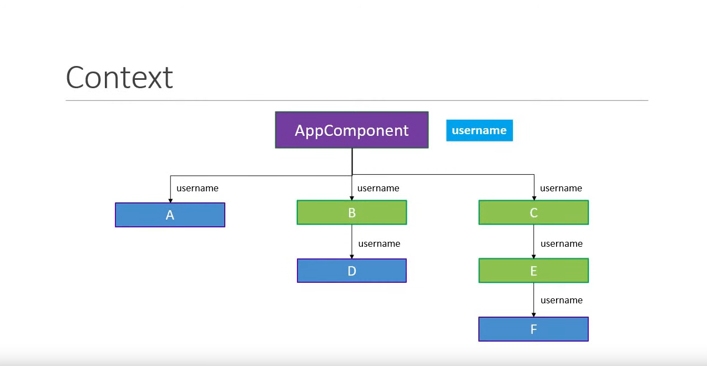
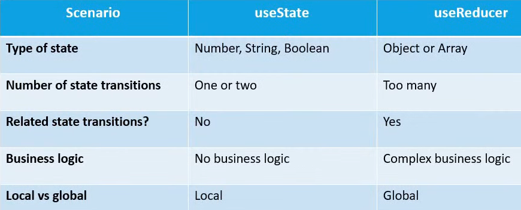

React Hooks allow you to write react features without having writing to a class
   
  ### Question is   Why Hooks ?

                            Classes make hot reloading Unreliable 
                            There is No way of using stateful component  Logic
                            Create components for complex scenirio eg data Fetching and Event Listeners

###   useState Hook

###   useeffect Hook
   
       allow you to perform side effects in functional components. A close replacement of componentdidmount,componentdidupdate and componentwillunmount. 

###   useContext Hook
        is used to pass data to component tree without having to pass as props to each  level 
                           
                            Three Steps of useContext Hook
                                  
                                  1 - createContext
                                  2 - Provide Context
                                  3 - Consume Context

### UseReducer Hook 
            
                            Used in state management in react
                            UseReducer is related to reducer functions
                            UseReducer(reducer,initialstate)
                            reducer(state,action)

      
  

### Usecallback Vs useMemo Hook

                               If u want to cash a function use useCallback Hook
                      If u want to cash a result of an invoked function use useMemo Hook

### useRef Hook 

                      Used to something like globally btw useEffect and return